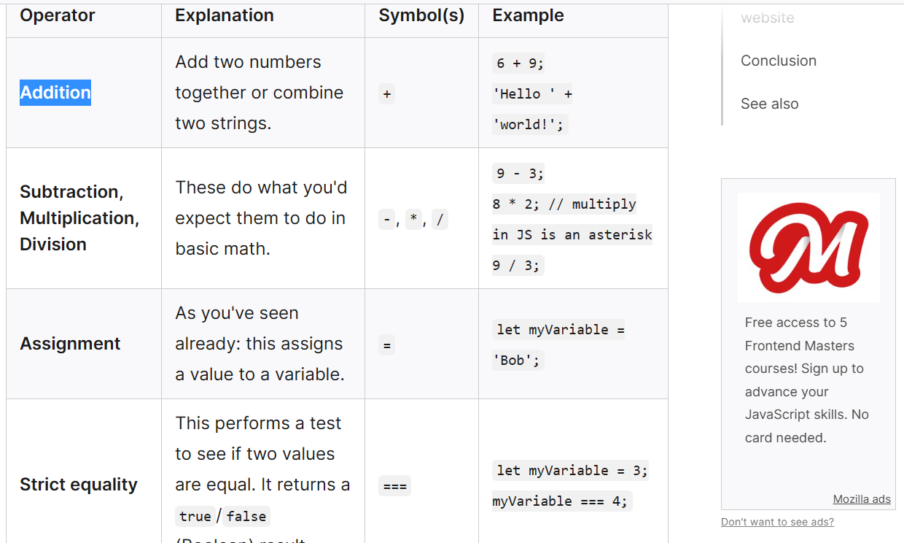

## Continue Reading Introduction to HTML

### Why is it important to use semantic elements in our HTML?
To be more organize and the make information easier to penpoint.

### How many levels of headings are there in HTML?
H1-H6

### What are some uses for the  and  elements?
It is used for edit font of formaulas.
It makes the characters smaller as well as move either up of down depending on which term you use.

### When using the <abbr> element, what attribute must be added to provide the full expansion of the term? 
It is used for abbreviating, required a title attribute

## Learn CSS

### What are ways we can apply CSS to our HTML?
internally, inline, and externally 

### Why should we avoid using inline styles?
Firstly, it can't be reused to another elment or class without retyping.
Secondly, its less organize due to you mixing the content with the actual design.

### Review the block of code below and answer the following questions:
   h2 {
     color: black;
     padding: 5px;
   }
### What is representing the selector?
H2

### Which components are the CSS declarations?
{
    color:black  ;
    padding:5px;
}

### Which components are considered properties?
color
padding

## Learn JS

### What data type is a sequence of text enclosed in single quote marks?
They are strings

### List 4 types of JavaScript operators.

### Describe a real world Problem you could solve with a Function.
You can use a function to calculate the total cost of a purchase, including tax and any discounts.

## Making Decisions In Your Code – Conditionals.
### An if statement checks a __ and if it evaluates to ___, then the code block will execute.
condition, true or false

### What is the use of an else if?
If else statement is a way to chain on extra choices.

### List 3 different types of comparison operators.
  === and !==
  < and >
  <= and >=

### What is the difference between the logical operator && and ||?
&& requires all to read as true in order to be true.
while || require only one to be true.

## Things I want to know more about?